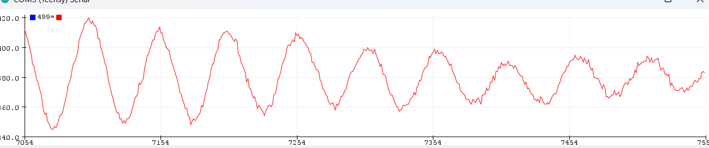
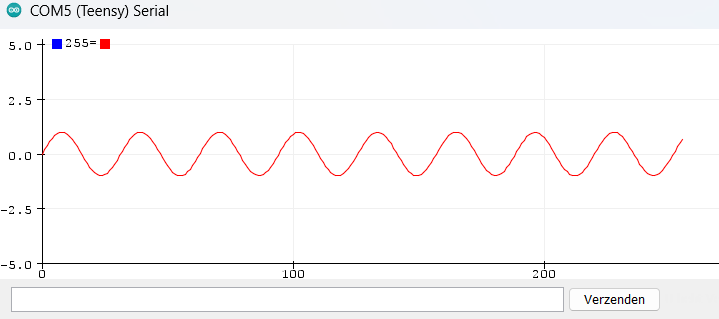
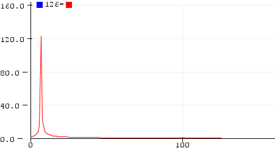
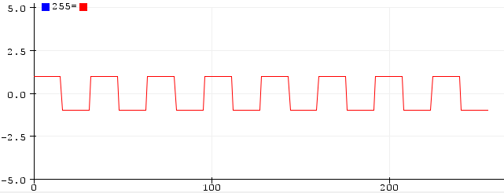
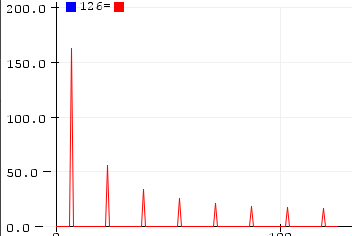
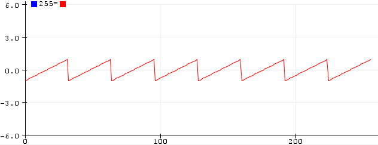
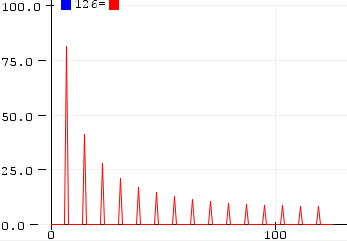
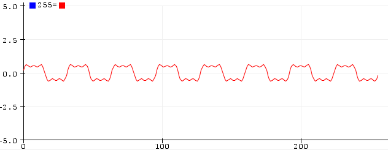
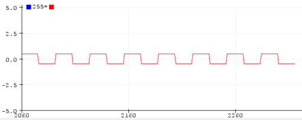

# Opdracht 1

1. Waar staat ARM voor?

    Advanced Risc Machines

2.  Welke micro processor zit er op de Teensy3.2?

    ARM Cortex-M4

3. Wat is de kloksnelheid en intern geheugen van deze processor?

    kloksnelheid: 72 MHz - Geheugen: 64KB

4. Pas de code nu dusdanig aan dat de speaker op de Teensy Board met een frequentie van 500 Hz gaat piepen door deze 1 ms aan en 1 ms uit te zetten. Zoek in het Schema van de Teensy Board (BrightSpace) op welke poort de speaker zit. (letop!: een pin-nummer is geen poortnummer) Zet deze code in je practicum-verslag.


    ```cpp
    void setup(){
    pinMode(3, OUTPUT);
    }

    void loop() {
    digitalWrite(3, HIGH);
    delay(1);
    digitalWrite(3, LOW);
    delay(1);
    }
    ```

5. Wat zijn de argumenten die samplingTimer meekrijgt, en verklaar dat.

    Het krijgt de functie sample en een tijdsinterval van 100ms mee.

6. Gegeven dat het lezen van een analoge waarde en omzetten naar een digitale waarde 10 microseconden duurt, wat zou de maximale sampling frequentie dan kunnen zijn?

    10*10^-6 = 0,00001

    1/0.00001 = 100.000 KHz

7. Kopieer het plaatje in je practicum verslag.

    

8. Het plaatje laat een laag frequent (stoor) signaal zien. Schat aan de hand van het plaatje de frequentie in van dit signaal, en verklaar hoe je aan deze schatting komt.

    $T = 500μs * 100μs = 50 ms $ 

    Het signaal gaat 7 keer. Dus $1000 ms/50ms*7=140 Hz$

9. Kopieer het plaatje in je practicum-verslag. Leg uit wat je nu ziet. Stel dat de samplefrequentie 9000 Hz is. Schat en verklaar uit dit plaatje de frequentie van het signaal.
    
    

    Er zijn 256 samples gemaakt. met een sampling frequentie van 9000 Hz betekent dat dus dat deze afbeelding is gesampled in $256 / 9000 = 0.02844444444$ seconden. De golven worden 8 keer herhaalt en dat betekent dat een frequentie van $1/(0.02844444444 / 8) = 281$ Hz wordt gebruikt.

10. Kopieer het plaatje in je practicum verslag. Leg uit wat je nu ziet.

    

Ik zie een piek aan de linkerkant van de grafiek.

11. Bij welke “f”-waarde ligt de piek?

    De piek ligt bij de “f”-waarde 8

12. Gegeven is dat de sampling frequentie 9000Hz was. Wat is dan de frequentie van het gemeten signaal? (beargumenteer je antwoord volledig)

    Het signaal in de afbeelding is 256 keer gesampled. De frequentie-bin is 8, dus $1/(256/9000/8) = 281,25$ Hz

13. Kopieer de plaatjes van het tijdsdomein en frequentiedomein in je practicum-verslag en geef een verklaring. Bij welke “f”-waarden in het frequentiedomein liggen de pieken?

    

    

    De pieken liggen op de "f"-waarden: `8`, `24`, `40`, `56`, `72`, `88`, `104` en `120`

    De reden dat de pieken hier liggen is omdat het signaal een blokgolf signaal is.

14. Stel dat de sampling frequentie 20kHz was. Wat was dan de basisfrequentie (grondtoon)? En beargumenteer je antwoord.

    sampletijd = $1 / 20$ KHz $ = 0.00005 $ s

    periode = $32$ samples

    periodetijd = $0.0016$

    Dus de grondtoon is $ 1/0,0016 = 625$

15. Kopieer de plaatjes van het tijdsdomein en frequentiedomein in je practicum-verslag. Als het signaal van vraag 10 een blokgolf heet, hoe zou je dit signaal noemen?

    
    

    Dit is een sawtooth wave signaal

16. Kopieer het plaatje in je practicum-verslag en geef een verklaring.

    

    Voor het blokkerig maken van een sinus signaal zijn er hoge frequenties nodig. Omdat de code hier is aangepast en er dus een laagdoorlaatfilter van is gemaakt zijn deze hogere frequenties er niet meer en wordt het signaal dus minder blokkerig.

17. Bij welke waarde komt er in het tijdsdomein een redelijke blokgolf uit.

    Bij een waarde van `128` komt er een redelijke blokgolf uit.

     