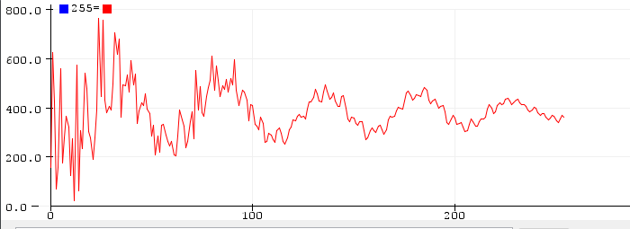
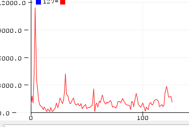
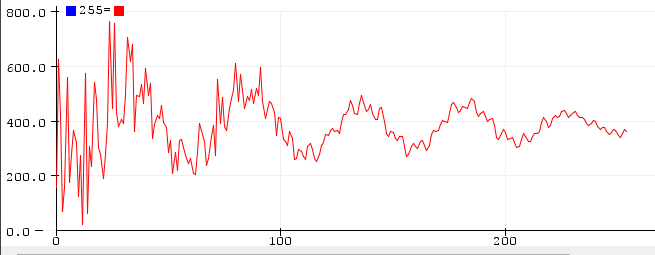
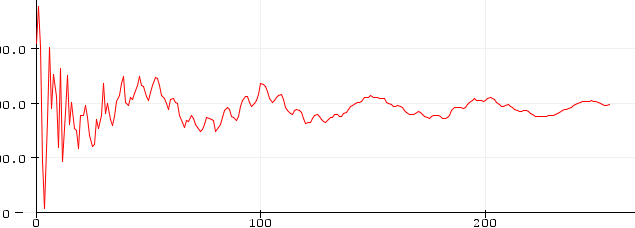
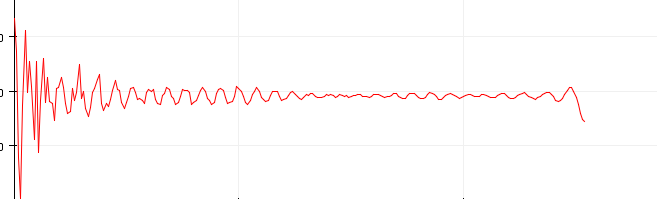
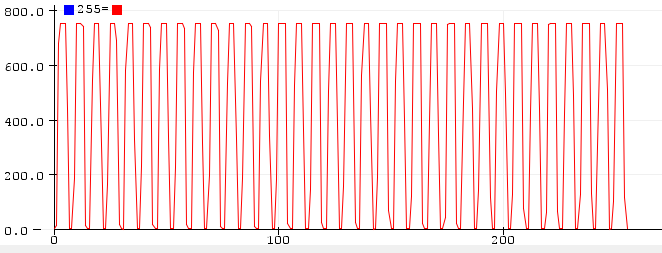
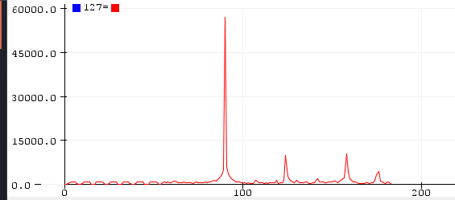
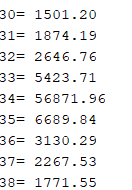
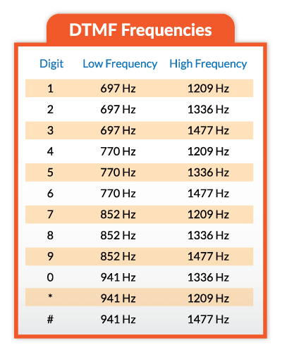

# Opdracht 2

1. Wat is de hoogste en wat is de laagste frequentie die je kunt meten?

    Hoogste freq: 9000 / 2 = 4500 Hz

    laagste freq: 9000 / 256 = 35.15625 Hz

2. Gegeven dat in dit programma een sample-meting een gemiddelde is van ADC 16 metingen (ANALOG_READ_AVERAGING = 16), hoelang duurt dan 1 sample-meting? (Tip: gebruik hiervoor micros() in je code)

    ```arduino
    startMicros = micros();
    samples[sampleCounter] = (float32_t)analogRead(AUDIO_INPUT_PIN);
    stopMicros = micros();
    ```

    ```
    Elapsed Time: 33
    Elapsed Time: 33
    Elapsed Time: 33
    Elapsed Time: 33
    Elapsed Time: 33
    Elapsed Time: 33
    Elapsed Time: 33
    ```

    1 sample meting duurt 33 μs.

3. loopt dat niet knel met de tijd tussen twee samples?

    Dit zit niet in de knel want 33 < periodetijd. Dit is 1/9000 = 111 μs.

4. hoeveel tijd in micro-seconden zit er tussen twee samples? (T1 in figuur)

    Omdat de sampleingtijd 111 μs is is de tijd tussen de twee samples 111 μs

5.  Hoelang (in milli-seconden) duurt het om het signaal in de tabel te plaatsen. (T2 in figuur)

    De tijd in ms is 0,022 ms.

    ```
    Elapsed Time: 22
    ```

    ```arduino
    startMicros = micros();
    for (int t = 0; t < 256; t++) timeDomainRaw[t] = samples[2 * t]; // Copy the samples into TimeDomain as the FFT uses samples as output
    stopMicros = micros();
    Serial.print("Elapsed Time: "); 
    Serial.println(stopMicros - startMicros);
    ```

6. Wat is de Frequentie Resolutie (in Hz)?

    De frequentie resolutie is hetzelfde als de laagste frequentie en dus 35.15625 Hz.

7. Kopieer de plaatjes van het tijdsdomeinRaw, frequentiedomein en tijdsdomeinRev in je practicum-verslag en geef een verklaring.

    tijdsdomein raw

    

    freq domein

    

    tijdsdomein rev

    

    Er zit bijna geen verschil tussen tijdsdomein raw en tijdsdomein rev. De piek aan het begin van het frequentiedomein is omdat daar de hoogste draaggolf zit in de tijdsdomeinen.

8. Hoelang in micro-seconden duurt de FFT-berekening. (T3 in fig.) Tip: gebruik micros() in je code.

    5319 μs

9. Stel de vertragingstijden T1, T4, T5 en T6 zijn verwaarloosbaar t.o.v. de andere tijden. Wat is de totale vertragingstijd van dit systeem? Is dit systeem geschikt voor b.v. een gehoorapparaat?
(https://audiologieboek.nl/content/9-2-52-digitale-signaalbewerking-in-hoortoestellen-principes/)

    T2 + T3 = 5,319 ms + 0,022 ms = 5,341 ms.

    Dit is wel geschikt voor een gehoorapparaat onlangs hoelang de FFT berekening duurt, want volgens het artikel is 10ms acceptabel en 5 < 10.

10. Kopieer de plaatjes van de twee tijdsdomeinen in je practicum-verslag en geef een verklaring.

    

    

    hoge bins zijn uit het plaatje gehaald, dus zijn de golven minder.

11. Kopieer de plaatjes van het tijdsdomein en frequentiedomein in je practicum-verslag en geef een verklaring.
    
    1200 Hz

    tijdsdomein:

    

    Frequentiedomein:

    

    De piek van de 1200 Hz is duidelijk te zien op de grafiek van het frequentiedomein

12. Vraag 12: Zoek de “i” waarde waar het gemeten signaal zich moet bevinden en bereken uit het resultaat van het frequentie domein de gemeten frequentie.

    

    9000 / 256  = 35,15625 * 35 = 1.230,46875 Hz

13. geef de tabel van de DTMF tonen.

    

14. Laat de werking aan de docent zien en zet de (*.ino) code in de bijlage van je verslag.

```arduino
// filename: TeensyFTTaudio.
// Autor: J. v/d Helder
// co-author: I. van Oort
// date 21/05/2021
// program developed for Teensy3.2 on Arduino IDE with the TeensyDruino plugin
// When button SW1 is pressed, the sample table with measured audio data and the FFT is calculated
// When button SW2 is pressed the serial output will be the samples array (when SW3 is switched up),
// which is filled with a measured audio signal from a microphone or the calculated FFT-values (when SW3 is switched down)
// adjusted to include SW4
#define ARM_MATH_CM4
#include <arm_math.h>

////////////////////////////////////////////////////////////////////////////////
// CONFIGURATION
// These values can be changed to alter the behavior of the spectrum display.
// Nr of bins = FFT_SIZE / 2
// Frequency Resolution (FR) = Fmax / nrOfBins    or   FR = sample_rate / FFT_SIZE
// Fmax = sample_rate /2
// If sampleRate = 9000 and FFT_SIZE = 256, then FR = 35.156 Hz (the bins are separated with FR)
////////////////////////////////////////////////////////////////////////////////

unsigned long startMicros;
unsigned long stopMicros;

int SAMPLE_RATE_HZ = 9000;             // Sample rate of the audio in hertz.
const int FFT_SIZE = 256;              // Size of the FFT.  Realistically can only be at most 256
const int BUTTON1 = 4;
const int BUTTON2 = 5;
const int SWITCH3 = 6;
const int SWITCH4 = 7;
const int LED1 = 11;
const int LED2 = 12;
const int LED3 = 13;
const int AUDIO_INPUT_PIN = 23; //A9        // Input ADC pin for audio data.
const int ANALOG_READ_RESOLUTION = 10; // Bits of resolution for the ADC.
const int ANALOG_READ_AVERAGING = 16;  // Number of samples to average with each ADC reading.
// any other changes to the program.
const int MAX_CHARS = 65;              // Max size of the input command buffer

IntervalTimer samplingTimer;
float samples[FFT_SIZE * 2];
float timeDomainRaw[FFT_SIZE];
float timeDomainRev[FFT_SIZE];
float freqDomain[FFT_SIZE];
int sampleCounter;
int prevInput = 0;
int prevOutput = 0;
char commandBuffer[MAX_CHARS];
void samplingBegin();
void setup() {
  // Set up serial port.
  Serial.begin(38400);

  // Set up ADC and audio input.
  pinMode(BUTTON1, INPUT);
  pinMode(BUTTON2, INPUT);
  pinMode(SWITCH3, INPUT);
  pinMode(SWITCH4, INPUT);
  pinMode(LED1, OUTPUT);
  pinMode(LED2, OUTPUT);
  pinMode(LED3, OUTPUT);
  pinMode(AUDIO_INPUT_PIN, INPUT);
  analogReadResolution(ANALOG_READ_RESOLUTION);
  analogReadAveraging(ANALOG_READ_AVERAGING);

  // Clear the input command buffer
  memset(commandBuffer, 0, sizeof(commandBuffer));
}

void loop() {
  if (true) {
    digitalWrite(LED1, HIGH);
    // Begin sampling audio
    sampleCounter = 0;
    samplingBegin();
    while (sampleCounter < 512) delay(1);
    digitalWrite(LED1, LOW);

    digitalWrite(LED2, HIGH);
    for (int t = 0; t < 256; t++) timeDomainRaw[t] = samples[2 * t]; // Copy the samples into TimeDomain as the FFT uses samples as output;
    // Calculate FFT if a full sample is available.
    // Run FFT on sample data.
//    startMicros = micros();
    arm_cfft_radix4_instance_f32 fft_inst;
    arm_cfft_radix4_init_f32(&fft_inst, FFT_SIZE, 0, 1);
    arm_cfft_radix4_f32(&fft_inst, samples);  // samples now contains the real and imaginairy part of the FFT
    // Calculate magnitude of complex numbers output by the FFT.
    arm_cmplx_mag_f32(samples, freqDomain, FFT_SIZE);
    int freqA = 0;
    int freqB = 0;
    for (int i = 4; i < 128; i++) { // print only first half, the others are imaginary, f = 4 to skip noise.
      if(freqDomain[i] >= 6000){
        float freq = (float)i*((float)SAMPLE_RATE_HZ/FFT_SIZE);
        if(freq > (697-40) && freq < (697+40))
          freqA = 697;
        else if(freq > (770-40) && freq < (770+40))
          freqA = 770;
        else if(freq > (852-40) && freq <(852+40))
          freqA = 852;
        else if(freq > (941-40) && freq < (941+40))
          freqA = 941;

        if(freq > (1209-40) && freq < (1209+40))
          freqB = 1209;
        else if(freq > (1336-40) && freq < (1336+40))
          freqB = 1336;
        else if(freq > (1477-40) && freq < (1477+40))
          freqB = 1477;
        else if(freq > (1633-40) && freq < (1633+40))
          freqB = 1633;
        }
      }

      if(freqA == 697 && freqB == 1209)
        Serial.print('1');
      if(freqA == 697 && freqB == 1336)
        Serial.print('2');
      if(freqA == 697 && freqB == 1477)
        Serial.print('3');
      if(freqA == 770 && freqB == 1209)
        Serial.print('4');
      if(freqA == 770 && freqB == 1336)
        Serial.print('5');
      if(freqA == 770 && freqB == 1477)
        Serial.print('6'); 
      if(freqA == 852 && freqB == 1209)
        Serial.print('7');
      if(freqA == 852 && freqB == 1336)
        Serial.print('8');
      if(freqA == 852 && freqB == 1477)
        Serial.print('9');
      if(freqA == 941 && freqB == 1336)
        Serial.print('0'); 
      if(freqA == 941 && freqB == 1209)
        Serial.print('*');
      if(freqA == 941 && freqB == 1477)
        Serial.print('#');

      
    }

    
    digitalWrite(LED2, LOW);

    delay(400);

}

////////////////////////////////////////////////////////////////////////////////
// SAMPLING FUNCTIONS
////////////////////////////////////////////////////////////////////////////////

void samplingCallback() {
  // Read from the ADC and store the sample data

  samples[sampleCounter] = (float32_t)analogRead(AUDIO_INPUT_PIN);
//  int sampleBuffer = samples[sampleCounter];
//  samples[sampleCounter] = samples[sampleCounter] - prevInput + 0,6 * prevOutput;
//  prevInput = sampleBuffer[sampleCounter];
  // Complex FFT functions require a coefficient for the imaginary part of the input.
  // Since we only have real data, set this coefficient to zero.
  samples[sampleCounter + 1] = 0.0;
  // Update sample buffer position and stop after the buffer is filled
  sampleCounter += 2;
  if (sampleCounter >= FFT_SIZE * 2) {
    samplingTimer.end();
  }
}

void samplingBegin() {
  // Reset sample buffer position and start callback at necessary rate.
  sampleCounter = 0;
  samplingTimer.begin(samplingCallback, 1000000 / SAMPLE_RATE_HZ);
}
```