# Opdracht 3 sensoren

<script type="text/javascript" src="http://cdn.mathjax.org/mathjax/latest/MathJax.js?config=TeX-AMS-MML_HTMLorMML"></script>
<script type="text/x-mathjax-config">
  MathJax.Hub.Config({ tex2jax: {inlineMath: [['$', '$']]}, messageStyle: "none" });
</script>

1. Kopieer het plaatje in je practicum-verslag en geef een verklaring.

    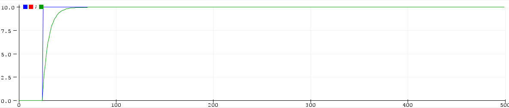

    De blauwe lijn is het ingangssignaal en de groene lijn is het uitgangssignaal waarop je duidelijke kan zien dat er een laagdoorlaat wordt toegepast.

2. Geef de differentievergelijking van het digitale hoogdoorlaatfilter in het n-domein

    laagdoorlaat:

    $Y[n] = 0.15*X[n] + 0.85*Y[n-1]$

    hoogdoorlaat:

    $Y[n] = X[n] + (C * Y[n-1] - X[n-1])$

3. kopieer het plaatje in het practicum verslag en geef een verklaring.

    hoogdoorlaat:

    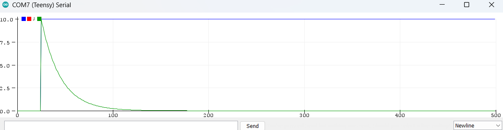

    ```arduino
    for (int n = 1; n <500; n++){
        if (n<25) X[n] = 0.0; else X[n] = 10.0;  // Heavisidefunction
        //Digitale Filter
        float C = 0.95123;
        Y[n] = X[n]-X[n-1]+C*Y[n-1];
    } 
    ```

4. Gegeven fs = 10KHz, wat is de kantelfrequentie fc van dit filter?(fc = 1/τ) (τ  in het figuur)

    ```
    10.00 ; 9.51
    10.00 ; 9.05
    10.00 ; 8.61
    10.00 ; 8.19
    10.00 ; 7.79
    10.00 ; 7.41
    10.00 ; 7.05
    10.00 ; 6.70
    10.00 ; 6.38
    10.00 ; 6.07
    10.00 ; 5.77
    10.00 ; 5.49
    10.00 ; 5.22
    10.00 ; 4.97
    10.00 ; 4.72
    10.00 ; 4.49
    10.00 ; 4.27
    10.00 ; 4.07
    10.00 ; 3.87
    10.00 ; 3.68
    ```

    $36,8$ % van beginwaarde is $0,368 * 10 = 3,68$


    Bij $T = 20$ is de beginwaarde $36,8$% en komt $\tau = \frac{1}{f_s} * 20 = \frac{1}{10000} * 20 = \frac{1}{500} = 500$ Hz

5. Is dit de karakteristiek van een hoog of laagdoorlaatfilter, en waarom?

    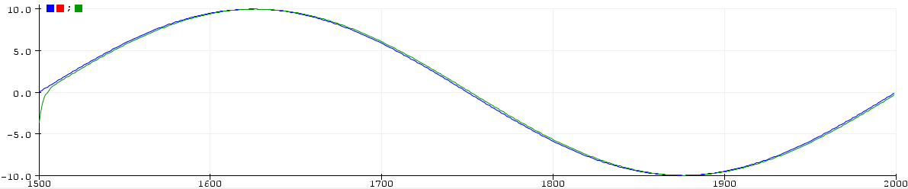

    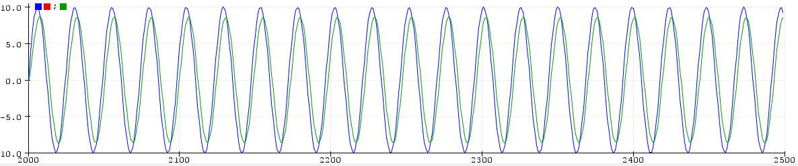

    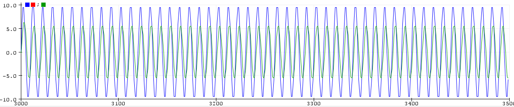

    Het is karakteristiek van een laagdoorlaat filter. Dit is te zien aan dat van de groene lijn er steeds lager komt dan de blauwe lijn naarmate de frequenties hoger komen te staan.

6. schat de kantelfrequentie (fc) in aan de hand van de afbeelding.

    $Ymax = 0,707 * Xmax = 0,707 * 10 = 7,07$

    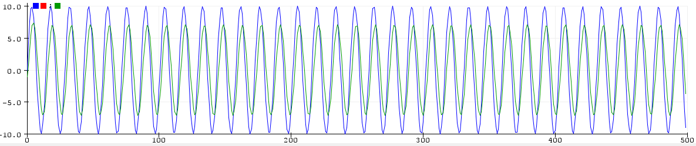

    ongeveer 34 golven en 500 samples Dit betekent dat er $500/34=14,7$ samples zijn. Dit betekent dat een golf $\frac{1}{10000}*14,7 = 0,00147$ s. Dus de frequentie is $f_c = \frac{1}{0,00147} = 679$ Hz.

7. loopt het uitganssignaal Yn nu π/4 rad voor of achter op het ingangssignaal Xn?

    Het uitgangssignaal loopt achter op het ingangssignaal.

8. Is dit de karakteristiek van een hoog- of laagdoorlaatfilter, en waarom?

    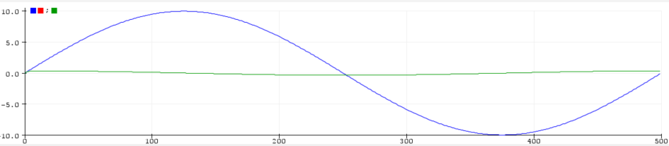

    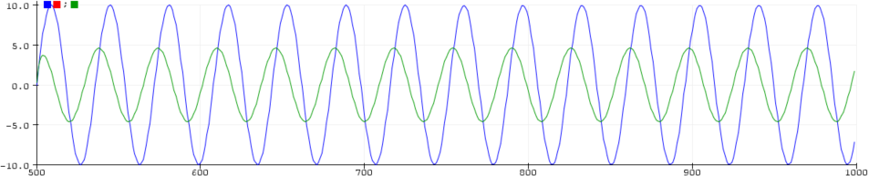

    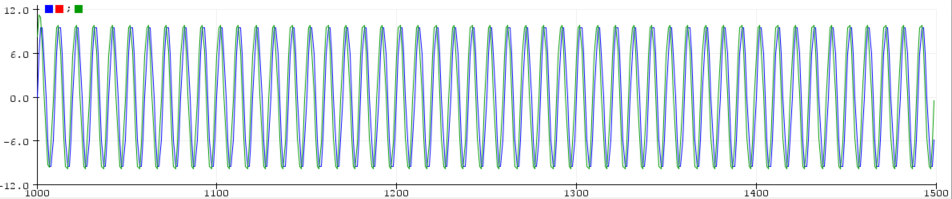

    Dit is karakteristiek van een hoogdoorlaatfilter, de lage frequenties worden gedempt en de hoge niet.

9. schat de kantelfrequentie in aan de hand van de afbeelding.

    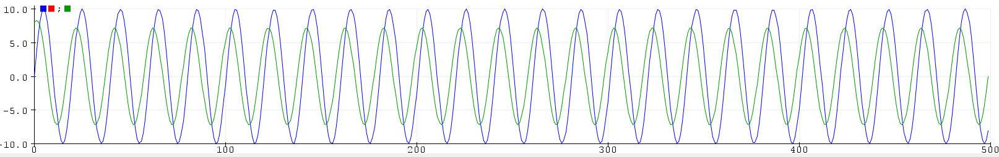

    500 samples en 25 golven. $500/25 = 20$ samples. Dit betekent dat een golf $\frac{1}{10000}*20 = 0,002$ s. Dus de frequentie is $f_c = \frac{1}{0,002} = 500$ Hz.

10. loopt het uitganssignaal nu π/4 rad. voor of achter op het ingangssignaal?

    Het uitgangssignaal loopt achter op het ingangssignaal.

11. Maak het schema van dit digitale filter, en zet deze in je verslag.

    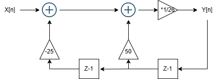

12. Bij welke frequentie heb je de hoogste uitgangswaarde? En hoe groot is deze (Ymax)? Neem dit plaatje over in de practicumverslag.

    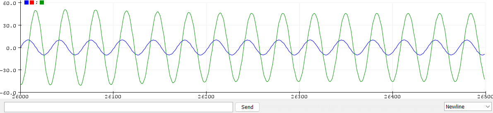

    Ymax = 51.

    samples = 500, golven = 15. Dus $500 / 15 = 33,3$ samples per golf. Dus de frequentie is: $\frac{1}{10000} * 15 = 0,0033$. Freq = $\frac{1}{0,0033} = 303$ hz

13. Wat is de begin- en eindwaarde van deze as (in Hz) en op welke frequentie ligt dus dan het maximum.

    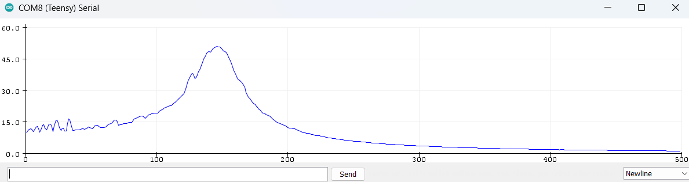

    samplingfrequentie = 10000, aantal samples = 500. $fs = \frac{10000}{500} = 20$ Hz. 20 Hz is ook de laagste frequentie. De maximale frequentie is $10000 / 2 = 5000$ Hz. 
    
    De piekwaarde ligt op 157. De frequentie die hierbij hoort is: $20 * 157 = 3120$ Hz

14. Wat is de  overgangsfunctie voor de lage frequenties en voor de hoge frequenties

    De overgangsfunctie lijkt hier een laagdoorlaat filter te zijn. Dit is te zien doordat de waardes bij de lage frequenties veel hoger liggen dan de waardes bij de hoge frequenties.

15. Hoe zou je een dergelijk filter noemen.

    laagdoorlaatfilter

16. neem het plaatje over in je practicum verslag en geef een verklaring. 

    

    De overgangsfunctie lijkt hier een laagdoorlaat filter te zijn. Dit is te zien doordat de waardes bij de lage frequenties veel hoger liggen dan de waardes bij de hoge frequenties.

17. Maak van het onderstaande  schema van een digitale filter de differentie formule voor Y[n].

    $Y[n] = (X[n] + x[n-1] * a + x[n-2] * b) * C + y[n-1] * d + y[n-2]* e$

18. Schat aan de hand van de horizontale schaal wat de frequentie is van het minimum. 

    Minimum bin is 380. De frequentie die hier bij hoort is $380 * 20 = 7600$ Hz

19. Wat is de  overgangsfunctie voor de lage frequenties en voor de hoge frequenties

    Voor alle frequenties is de functie 10. Behalve rond de 7600 Hz. Daar wordt de functie 0.

20. Hoe zou je een dergelijk filter noemen.

    Persoonlijk zou ik het een bandstopfilter noemen.

21. neem het plaatje over in je practicum verslag. 

    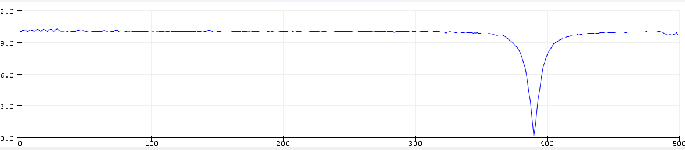

22. Wat is nu de vertragingstijd van de DSP (T2 in fig.)?

    met micros krijg ik tussen de 1 en de 2 ms als vertragingstijd.
    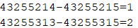

23. Bij welke frequentie is dit.?

    800 Hz